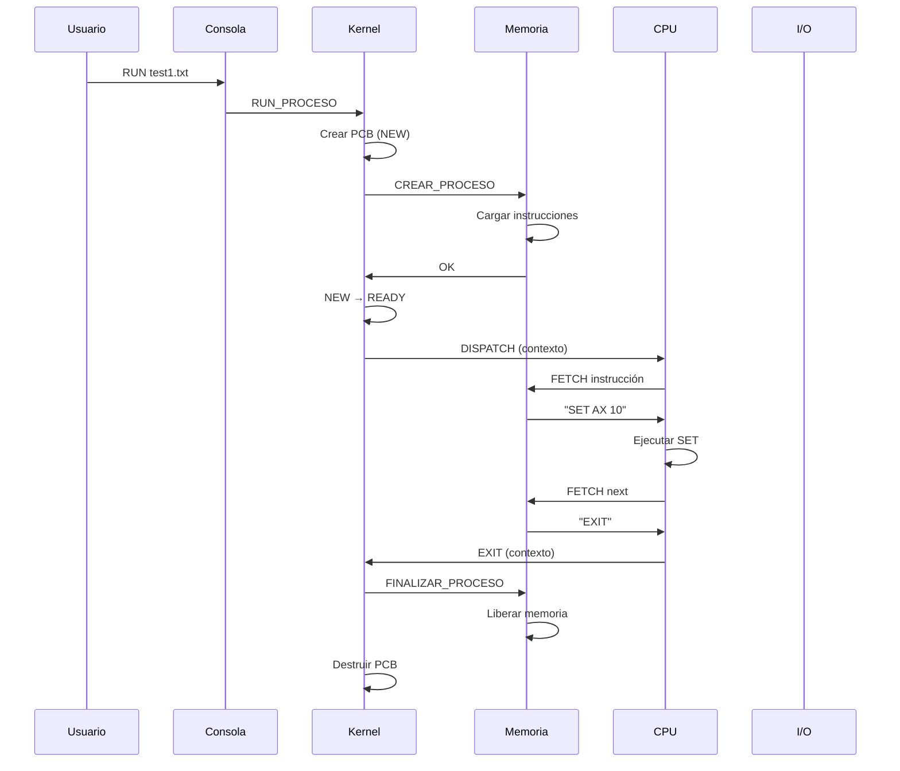

# Video 25 - Recapitulación: El SO Completo

**Duración estimada:** 10-15 minutos  
**Bloque:** Testing y Cierre

---

## Recorrido End-to-End

### Desde `RUN test1.txt` hasta `EXIT`

```
1. CONSOLA: Usuario escribe "RUN test1.txt"
2. CONSOLA → KERNEL: Envía paquete RUN_PROCESO
3. KERNEL: Crea PCB, estado NEW
4. KERNEL: Encola en cola_new, sem_post(sem_hay_new)
5. PLANIFICADOR LP: Despierta, solicita creación a Memoria
6. MEMORIA: Carga instrucciones del archivo
7. MEMORIA → KERNEL: Confirmación
8. KERNEL: NEW → READY, sem_post(sem_hay_ready)
9. PLANIFICADOR CP: Despierta, selecciona PCB según algoritmo
10. KERNEL → CPU: Dispatch con contexto serializado
11. CPU: Ciclo fetch-decode-execute
12. CPU ↔ MEMORIA: Fetch instrucciones, read/write datos
13. CPU ↔ MMU ↔ TLB: Traducciones de direcciones
14. CPU: Ejecuta EXIT
15. CPU → KERNEL: Devuelve contexto, motivo=EXIT
16. KERNEL: Libera recursos, notifica Memoria
17. MEMORIA: Libera frames, destruye tabla de páginas
18. KERNEL: Destruye PCB, sem_post(sem_mp)
19. FIN
```

---

## Diagrama de Secuencia Completo



---

## Patrones de Diseño Utilizados

### 1. Semáforos (Sincronización)
- `sem_hay_new`: Notificar planificador LP
- `sem_hay_ready`: Notificar planificador CP
- `sem_mp`: Control de multiprogramación

### 2. Mutex (Exclusión Mutua)
- `mutex_cola_ready`: Proteger cola
- `mutex_bitmap`: Proteger bitmap de frames
- `mutex_recurso`: Proteger cada recurso

### 3. Condition Variables (Espera Condicional)
- `cond_pause`: PAUSE/START de planificación

### 4. Function Pointers (Polimorfismo)
- `proximoAEjecutar`: Cambiar algoritmo dinámicamente
- `esquema->traducir`: Paginación vs segmentación

### 5. Serialización (IPC)
- Paquetes: enviar estructuras por red
- Protocolo bien definido (opcodes)

---

## ¿Qué Simplificamos vs SO Real?

### Nuestro TP
- 1 CPU (monocore)
- Memoria sin cache (salvo TLB)
- Filesystem básico (no journaling)
- Sin scheduling multicore
- Sin protección de kernel mode vs user mode
- Sin DMA para I/O
- Sin interrupciones de hardware reales

### Linux Real
- Multicore, SMP
- Cache L1/L2/L3
- Filesystems: ext4, btrfs, etc.
- CFS scheduler (Completely Fair)
- Ring 0 (kernel) vs Ring 3 (user)
- DMA controllers
- Interrupciones IRQ reales

---

## Lo Que Logramos

### ✓ Implementado
- Gestión de procesos (PCB, estados)
- 5 algoritmos de planificación
- Memoria virtual (paginación y segmentación)
- MMU con TLB
- Swap con algoritmo Clock
- Sincronización (WAIT/SIGNAL)
- Detección de deadlock (grafo + banquero)
- I/O asíncrona (STDIN, STDOUT, sleep, filesystem)
- Comunicación por sockets
- Test suite automatizada

### Conocimientos Adquiridos
- Arquitectura de SO
- Concurrencia (threads, mutex, semáforos)
- IPC (sockets, serialización)
- Gestión de memoria virtual
- Scheduling
- Deadlock
- I/O

---

## Posibles Extensiones

### Scheduling
- **Aging:** Prevenir starvation en prioridades
- **Multicore:** Más CPUs, migración de procesos
- **Real-time:** Garantías de latencia

### Memoria
- **Demand paging:** Cargar páginas bajo demanda
- **Copy-on-write:** Optimización para fork()
- **Huge pages:** Reducir overhead de TLB

### Filesystem
- **Journaling:** Recuperación ante crashes
- **Inodos:** Estructura más compleja
- **Links simbólicos**

### I/O
- **DMA:** Acceso directo sin CPU
- **Buffering:** Cache de I/O
- **Async I/O:** io_uring style

---

## Reflexión Final

### Lo Importante
- **Abstracciones:** El SO es una colección de abstracciones
- **Concurrencia:** Manejo correcto es crítico
- **Trade-offs:** No hay soluciones perfectas
- **Debugging:** Logs son tu mejor amigo

### Aplicabilidad
- Entender sistemas de producción (Linux, Windows)
- Debugging de problemas de performance
- Diseño de sistemas distribuidos
- Embedded systems

---

## Recursos para Profundizar

### Libros
- *Operating System Concepts* (Silberschatz)
- *Modern Operating Systems* (Tanenbaum)
- *Operating Systems: Three Easy Pieces* (Arpaci-Dusseau)

### Proyectos
- xv6 (MIT): Unix didáctico
- Linux kernel (empezar por drivers simples)
- SerenityOS: SO moderno open source

### Cursos
- MIT 6.828 Operating System Engineering
- Stanford CS140 Operating Systems
- Berkeley CS162 Operating Systems

---

## ¡Felicitaciones!

Has completado un Sistema Operativo funcional desde cero.

**Próximos pasos:**
1. Revisar tu código
2. Experimentar con configuraciones
3. Agregar features
4. Estudiar SOs reales

**¡Éxito!** 🎉
